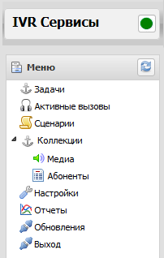
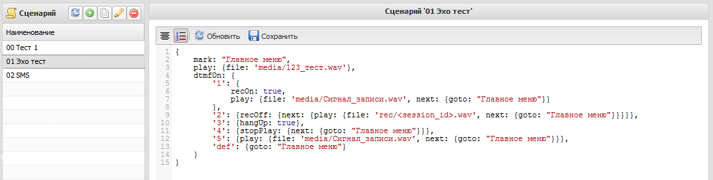
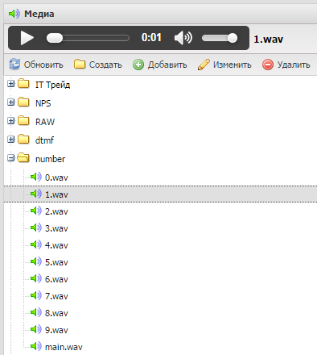
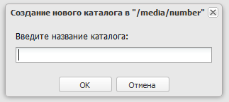
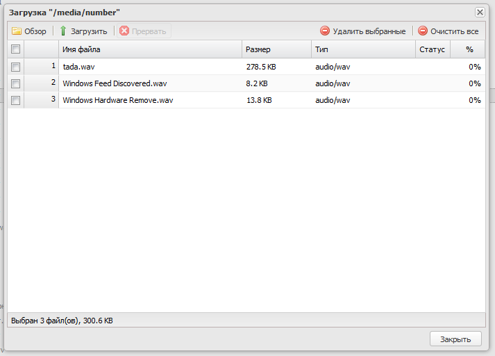
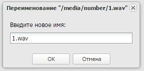
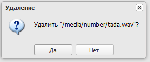
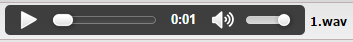

# Руководство администратора

## Описание структуры и настроек системы
### Меню
В левой части окна расположена панель с названием системы и значком доступности сервера. Ниже находится меню.

Рисунок 1. Меню системы

### Сценарии
Сценарий — последовательность действий, которые выполняются при запуске задачи.

При выборе пункта меню «Сценарии» область окна правее области меню делится на 2 части, которые позволяют создавать новые сценарии и настраивать существующие.

Рисунок 2. Список сценариев и пример сценария

В первой части расположена панель с названием пункта меню и кнопками операций со сценариями , с помощью которых можно обновить список сценариев, создать новый сценарий, создать копию сценария, переименовать и удалить выбранный сценарий. Все операции похожи на операции с задачами (подробнее можно посмотреть «Руководство пользователя»).

Во второй части расположено окно для редактирования выбранного сценария. Создавать сценарии может администратор системы MARS.

Для обновления содержимого окна редактора сценариев надо нажать кнопку . После изменения сценария для сохранения сделанных изменений надо нажать кнопку . Кнопка  позволяет сделать форматирование выделенного текста. Нажатие на кнопку  отображает/скрывает порядковые номера строк редактируемого текста.

### Коллекции
При двойном щелчке левой клавишей мыши на этом пункте появляются/скрываются подпункты этого меню. Это контейнер, содержащий два подпункта: «Медиа» и «Абоненты».

#### Медиа
При выборе пункта меню «Медиа» правее панели меню появляется панель «Медиа», где отображается коллекция аудио файлов, доступных для использования в сценариях.

Рисунок 3. Общий вид меню "Медиа"

##### Операции с коллекцией медиа
Для совершения той или иной операции с коллекцией медиа надо нажать соответствующую этой операции кнопку.

- обновление содержимого коллекции;

- создание нового каталога в текущем каталоге коллекции. При нажатии на эту кнопку появляется окно с полем ввода для задания имени нового каталога.

Рисунок 4. Запрос на ввод имени нового каталога коллекции медиа

Надо ввести новое имя и нажать кнопку «ОК» для создания каталога или нажать кнопку «Отмена» для отказа от создания каталога.

- добавить новый аудио файл в коллекцию медиа. При нажатии этой кнопки появляется окно, где можно добавлять медиа файлы в коллекцию.

Рисунок 5. Добавление файлов в коллекцию медиа

При появлении этого окна в нём нет никаких файлов. Для добавления файлов в коллекцию их надо выбрать. Делается этого при помощи нажатия кнопки «Обзор» в левом верхнем углу этого окна. Появится другое окно, где можно выбрать один или несколько аудио файлов. После подтверждения выбора эти файлы или файл появятся в окне добавления файлов. Но это действие ещё не добавляет файлы в коллекцию, а только подготавливает список файлов для добавления. То есть, ещё не загружая, какие-то выбранные файлы можно удалить, а оставшиеся уже загрузить в коллекцию. Для этого надо нажать кнопку , чтобы уже добавить выбранный файл в коллекцию. В процессе загрузки файла можно отменить его загрузку. Для этого надо нажать кнопку . После загрузки файл появляется в окне содержимого коллекции файлов медиа.

- изменить имя медиа файла. При нажатии это кнопки появляется окно, где можно задать новое имя файла, изменив старое в поле ввода.

Рисунок 6. Переименование файла медиа

Для подтверждения изменения надо нажать кнопку «ОК», для отмены изменения нажать кнопку «Отмена».

- удалить файл из коллекции медиа. При нажатии этой кнопки появляется окно с подтверждением удаления.

Рисунок 7. Удаление файла медиа

Для подтверждения надо нажать кнопку «Да», для отказа нажать кнопку «Нет».

Выбранный файл в коллекции можно прослушать. Для управления прослушиванием можно использовать проигрыватель, который находится между заголовком медиа и строкой кнопок по операциям с файлами медиа.

Рисунок 8. Проигрыватель файлов медиа

Этот проигрыватель позволяет запустить/остановить проигрывание, регулировать громкость звука и находить нужное место в проигрываемом файле.
 
- воспроизвести файл, - поиск нужного места в файле с помощью перетаскивания бегунка, - регулировка и отключения/включения громкости звука.

### Настройки
Здесь можно настраивать параметры системы. Настройки хранятся в JSON формате. Настроечный файл содержит следующие поля:

- **mPort** – порт для соединения с системой по telnet удалённых клиентов;
- **sipPort** — порт по которому система будет подключаться к  к SIP шлюзу. Если шлюзов несколько, номер порта будет автоматически увеличен;
- **webPort** — порт на котором будет запускаться web сервер системы;
- **stunServer** — адрес stun сервера;
- **webAccounts** — массив объектов, содержащий настройки пользователей. Каждый элемент массива  настройки отдельного пользователя, содержащий следующие поля:
    - **id** — идентификатор пользователя,
    - **username** — имя пользователя,
    - **password** — пароль пользователя,
    - **email** — адрес эл. почты пользователя;
- **maxCalls** — максимальное количество одновременных звонков системы;
- **logLevel** — объект, поля которого обозначают категории логгирования, значения — минимальный уровень логгирования (для настроек log4js);
- **ringingTimeout** — время дозвона в секундах (по истечении этого времени диалог прекращается);
- **serviceName** — имя сервиса, отображаемое при входящем звонке;
- **activeAccount** — текущий (активный) аккаунт (задётся номер в массиве sipAccounts);
- **def_tts** — система синтеза речи по умолчанию;
- **ivona_speech** — объект с настройками системы синтеза речи ivona, содержащий следующие поля:
    - **accessKey** — строка, содержащая ключ доступа
	- **secretKey** — строка, содержащая серетный ключ
	- **language** — язык синтеза речи (для русского: "ru-RU")
	- **name** — имя робота, произносящего текст
	- **gender** — пол, произносящего текст;
- **recognize** — объект с настройками внешней системы распознавания голоса, содержащий следующие поля:
	- **type** – имя внешней системы распознавания голоса (пока одно значение "yandex")
	- **options** – объект с настройками:
		- **developer_key** – ключ разработчика
		- **model** – модель распознавания голоса (general – общая модель распознавания, numbers – модель распознавания цифр и чисел);
- **sipAccounts** — массив объектов, содержащий настройки шлюзов. Каждый элемент массива является объектом, хранящим настройки шлюза. Для настройки шлюза указываются следующие поля:
    - **host** — адрес сервера,
    - **comment** — комментарий к шлюзу,
    - **expires** — время в секундах, через которое система будет подтверждать регистрацию на шлюзе,
    - **user** — имя пользователя шлюза,
    - **password** — пароль пользователя шлюза,
    - **disable** — разрешить или запретить активацию шлюза (1 — разрешить, 0 — запретить).

## Каталоги системы
Система содержит следующие каталоги, которые содержат:

**tasks** — файлы с задачами для системы; 
**config** — файл конфигурации системы;
**data** – файл базы данных системы, куда пишутся отчёты; 
**doc** – руководства пользователя и администратора системы; 
**media** – звуковые файлы для сценариев;
**rec** – файлы записанных сообщений;
**scripts** – файлы сценариев системы.

## Описание и примеры команд сценариев обработки звонков
Сценарий должен быть в формате Javascript объекта.

*Ключ* - команда или параметр, значение - параметр или значение параметра.

Все команды записываются в виде:
<команда> : <значение>, где значением может быть число, строка или объект.

Исполнение команд асинхронное. Чтобы исполнить команды синхронно, необходимо использовать свойство next.

**Допустимы следующие команды**

В примерах фоновым цветом выделены строки, относящиеся непосредственно к описываемой команде.

**dtmfData** - Включает запись в CDR (в файл cdr.db в поле "data") нажатых клавиш клавиатуры телефона

**синтаксис:**
    
    <dtmfData>::=true|{next: {<допустимые_команды>}};

**Пример:**

    dtmfData:
        {next: {
                mark: 'Главное меню',
                    play: {file: 'media/Спасибо_за_звонок.wav'},
                        dtmfOn: {
                            '1': {hangUp: true},
                                'def': {goto: 'Главное меню'}
                        },
                            wait: {time: 2,
                                next: {
                                        goto: 'Главное меню'
                                    }
                                }
            }
        }

**dtmfOn** - включается обработка ввода с клавиатуры телефона (допустима комбинация нажатий)

**синтаксис:**

    <dtmfOn>::={символ(ы)::=0|1|2|3|4|5|6|7|8|9|'#'|'*'| ['def'] | ['opt' ]: {<допустимые_команды>}, символ(ы), ...};

'def' - действие по умолчанию,
'opt' - параметры. Синтаксис: 'opt': {seq: true, endSeq: '#'}, где
	seq - указывет будет ли вводится последовательность,
	endSeq - указывает завершающий символ последовательности

Если endSeq отсутствует, завершающего символа не будет, а завершит последовательность длительная пауза между нажатиями.

В качестве символов может быть регулярное выражение.

**Пример:**

    {
        mark: 'Главное меню',
        play: {file: 'media/Спасибо_за_звонок.wav'},
        dtmfOn: {
                'opt': {seq: true, endSeq: '#'},
                '1': {hangUp: true},
                'def': {goto: 'Главное меню'}
                },
        wait: {time: 2,
                next: {
                        goto: 'Главное меню'
                    }
            }
    }

**sttOn** - включается обработка ввода голосом

**синтаксис:** 

    <sttOn>::={символ(ы)::=0|1|2|3|4|5|6|7|8|9|'#'|'*'| ['def'] | ['opt' ]: {<допустимые_команды>}, символ(ы), ...};

'def' - действие по умолчанию,
'opt' - параметры. Синтаксис: 'opt': {model: <название>, textFilter: <regExp>}, где
	model – название модели для распознавания речи. Чтобы распознавание было на нужном уровне, надо указать правильную модель. Если не указан этот параметр, по умолчанию выбирается модель queries.

Допустимы следующие модели:

- 'queries' — короткие запросы,
- 'numbers' — цифры и числа,
- 'general' — общий текст;

textFilter – регулярное выражение, ограничивающее передачу результатов распознавания в систему. Всё то, что не совпадает с результатом регулярного выражения не будет обработано системой. Можно не указывать этот параметр. Тогда не будет никакого ограничения на обработку результатов распознавания. 

В качестве символов может быть регулярное выражение.

**Пример:**

    {
        play: {file: 'media/Признесите 1, 2 или 3.wav', next: {
                mark: "Главное меню",
                sttOn: {
                    'opt': {model: 'general', textFilter: '1|2|3'},
                    '^1$': {play: {file: 'media/Сигнал_записи.wav',
                            next: {goto: "Главное меню"}}},
                    '^2$': {play: {file: 'media/Спасибо_за_оценку.wav',
                            next: {goto: "Главное меню"}}},
                    '^3$': {hangUp: true},
                    'def': {goto: "Главное меню"}
                }
            }
        }
    }

**goto** - оператор безусловного перехода с возвратом.

Переходит на метку, заданную командой mark. После перехода, выполняет команды (если они есть), находящиеся там же, что и goto, т.е. в пределах тех же фигурных скобок.

**синтаксис:** 

    <goto>::='имя_метки';

**Пример:**

    {
        mark: 'Главное меню',
        play: {file: 'media/Спасибо_за_звонок.wav'},
        dtmfOn: {
                '1': {hangUp: true},
                'def': {goto: 'Главное меню'}
                },
        wait: {time: 2,
                next: {
                        goto: 'Главное меню'
                    }
            }
    }

**hangUp** - завершить соединение

**синтаксис:** 

    <hangUp>::=true;

**Пример:**

    {
        mark: 'Главное меню',
        play: {file: 'media/Спасибо_за_звонок.wav'},
        dtmfOn: {
                '1': {hangUp: true},
                'def': {goto: 'Главное меню'}
                },
        wait: {time: 2,
                next: {
                        goto: 'Главное меню'
                    }
            }
    }

**mark** - задать метку

**синтаксис:** 

    <mark>::='имя_метки';

**Пример:**

    {
        mark: 'Главное меню',
        play: {file: 'media/Спасибо_за_звонок.wav'},
        dtmfOn: {
                '1': {hangUp: true},
                'def': {goto: 'Главное меню'}
                },
        wait: {time: 2,
                next: {
                        goto: 'Главное меню'
                    }
            }
    }

**on** - включается обработка ввода с клавиатуры телефона (допустима комбинация нажатий) и обработка ввода голосом.

**синтаксис:** 

    <on>::={символ(ы)::=0|1|2|3|4|5|6|7|8|9|'#'|'*'| ['def'] | ['opt' ]: {<допустимые_команды>}, символ(ы), ...};

Это не команда, а надстройка, которая запускает с заданными параметрами команды sttOn и dtmfOn.

**Пример:**

    {
    ttsPlay: {text: 'Добрый день', 
                next: {
                        ttsPlay: {text: 'Что вас интересует', 
                                    next: {
                                            mark: "Главное меню",
                                            on: {
                                                'opt': {model: 'general', textFilter: '[^а-я]'},
                                                '^1$|продаж': {recOn: true, ttsPlay: {text: 'Сейчас вы будете переведены в отдел продаж', next: {goto: "Главное меню"}}},
                                                    '^2$|поддержк': {recOn: true, ttsPlay: {text: 'Сейчас вы будете переведены в отдел техподдержки', next: {goto: "Главное меню"}}}
                                                }
                                            }
                                    }
                        }
            }
    }

**play** - проиграть заданный файл

**синтаксис:** 

    <play>::={file: 'имя_файла[;имя_файла;...]'[, next]};

Можно проиграть несколько файлов подряд. Для этого надо указать имена файлов через знак ";" (без пробелов) вместо 'имя_файла'.

**Пример:**

    {
        mark: 'Главное меню',
        play: {file: 'media/Здравствуйте.wav;media/Спасибо_за_звонок.wav'},
        dtmfOn: {
                '1': {hangUp: true},
                'def': {goto: 'Главное меню'}
                },
        wait: {time: 2,
                next: {
                        goto: 'Главное меню'
                    }
            }
    }

**recOff** - выключить запись звука и/или совершить заданные действия

**синтаксис:** 

    <recOff>::=true|{<допустимые_команды>};

**Пример:**

    {
        recOn: true,
        mark: 'Главное меню',
        play: {file: 'media/Спасибо_за_звонок.wav'},
        dtmfOn: {
                'opt': {seq: true, endSeq: '#'},
                '1': {recOff: true, hangUp: true},
                'def': {goto: 'Главное меню'}
                },
        wait: {time: 2,
                next: {
                        goto: 'Главное меню'
                    }
            }
    }

**recOn** - включить запись звука и/или совершить заданные действия

**синтаксис:**

    <recOn>::=true|{<допустимые_команды>};

**Пример:**

    {
        recOn: true,
        mark: 'Главное меню',
        play: {file: 'media/Спасибо_за_звонок.wav'},
        dtmfOn: {
                'opt': {seq: true, endSeq: '#'},
                '1': {hangUp: true},
                'def': {goto: 'Главное меню'}
                },
        wait: {time: 2,
                next: {
                        goto: 'Главное меню'
                    }
            }
    }

**refer** - перенаправление вызова

**синтаксис:**

    <refer>::={target: <цель>};

**Пример:**

    {
        mark: 'Главное меню',
        play: {file:'media/Спасибо_за_звонок.wav',
                next: {refer: {target: 128}}
            }
    }

**require** — подключение внешнего сценария (аналог команды include в с++).

**синтаксис:** 

    require('имя_сценария.js').src

**Пример:**

    {
    ttsPlay: {text: 'Добрый день', 
                next: {
                        ttsPlay: {text: 'Что вас интересует', 
                                    next: {
                                            mark: "Главное меню",
                                            on: {
                                                'opt': {model: 'general', textFilter: '[^а-я]'},
                                                '^1$|продаж': {recOn: true, ttsPlay: {text: 'Сейчас вы будете переведены в отдел продаж', next: {goto: "Главное меню"}}},
                                                    '^2$|поддержк': {recOn: true, ttsPlay: {text: 'Сейчас вы будете переведены в отдел техподдержки', next: {goto: "Главное меню"}}},
                                                    '^3$|опрос': require('./12345.js').src,
                                                }
                                            }
                                    }
                        }
            }
    }

**sendMESSAGE** - отправка SIP-сообщения.

**синтаксис:** 

    <sendMESSAGE>::={text: 'текст_сообщения'[, to: <sip_uri>, next]};

**to** – поле адреса в формате SIP URI: 'sip: id@domain'.

В качестве шлюза используется текущий.

**Пример:**

    {
    sendMESSAGE: {text: '[<session_id>] Тестовая передача MESSAGE', to: 'sip:digt11@sipnet.ru',
            next: {ttsPlay: {text: 'Сообщение отправлено', next: {hangUp: true}}}
                    }
    }

**sendSMS** - отправка SMS. В качестве SMS шлюза поддерживается только оператор «Мегафон».

**синтаксис:** 

    <sendSMS>::={text: 'текст_сообщения'[, msisdn: <отослать_на_номер>, next]};

Если отсутствует параметр msisdn, то сообщение отсылается на номер того, кто позвонил в систему MARS, в случае входящего звонка, и на номер того, кому звонит система MARS, в случае исходящего звонка.

В качестве шлюза используется multifon.ru. Перед отправкой сообщения multifon.ru ищется среди активных шлюзов. И если будет найден, сообщение отсылается, иначе не отсылается.

**Пример:**

    {
        play: {file: 'media/Приветствие.wav',
            next: {
                mark: "Главное меню",
                dtmfOn: 
                {
                    '[1-5]': {
                            sendSMS: {text: 'Ваша оценка <dtmfKeys>. Спасибо за звонок!', next: {hangUp: true}}
                            },
                    'def': {goto: "Главное меню"}
                },
                play: {file: 'media/Оцените_работу_оператора.wav'},
                wait: {time: 15,
                    next: {hangUp: true}
                }
            }
        }
    }

**stopPlay** - останавливает проигрывание файла

**синтаксис:** 

    <stopPlay>::={<допустимые_команды>};

**Пример:**

    {
        mark: "Главное меню",
        play: {file: 'media/123_тест.wav'},
        dtmfOn: {
            '3': {hangUp: true},
            '4': {stopPlay: {next: {goto: "Главное меню"}}},
            '5': {play: {file: 'media/Сигнал_записи.wav', next: {goto: "Главное меню"}}},
            'def': {goto: "Главное меню"}
        }
    }

**stt** - перевод речи (из файла) в текст

**синтаксис:** 

    <stt>::={file: 'имя_файла_с_речью'[, next]};

**Пример:**

    {
        play: {file: 'media/123_тест.wav',
            next: {
                mark: "Главное меню",
                dtmfOn: {
                    '1': {
                            stt: {file: 'rec/<session_id>.wav'}
                        },
                    '2': {hangUp: true},                
                    '3': {tts: {text: 'Добрый день', 
                                next: {play: {file: '<ttsFile>', 
                                    next: {goto: "Главное меню"}}}}},
                    'def': {goto: "Главное меню"}
                }
            }
        }
    }

**tts** - синтезирование речи

**синтаксис:** 

    <tts>::={text: 'текст_для_синтеза_речи'[, next]};

**Пример:**

    {
        play: {file: 'media/123_тест.wav',
            next: {
                mark: "Главное меню",
                dtmfOn: {
                    '1': {
                            stt: {file: 'rec/<session_id>.wav'}
                        },
                    '2': {hangUp: true},                
                    '3': {tts: {text: 'Добрый день', 
                                next: {play: {file: '<ttsFile>', 
                                    next: {goto: "Главное меню"}}}}},
                    'def': {goto: "Главное меню"}
                }
            }
        }
    }

**ttsPlay** – синтезирование речи с её произнесением

**синтаксис:** 

    <ttsPlay>::={text: 'текст_для_синтеза_и_произнесения_речи'[, rewrite: true, type:<название_синтезатора_речи>, next]};
	
**text** – текст для синтеза

**rewrite** – если true, то указывает, что нужно стирать ранее записанный файл со сгенерированным голосом

**type** – указывает какая внешняя система синтеза речи будет использоваться (допустимые значения: 'ivona', 'yandex').

**Пример:**

    {
        mark: 'Главное меню',
        ttsPlay: {rewrite: true, type:'ivona', text:'Спасибо за звонок',
                next: {goto: 'Главное меню'}
            }
    }

**wait** - ожидание в секундах

**синтаксис:**

    <wait>::={time: <количество_секунд>[, next]};

**Пример:**

    {
        mark: 'Главное меню',
        play: {file: 'media/Спасибо_за_звонок.wav'},
        dtmfOn: {
                '1': {hangUp: true},
                'def': {goto: 'Главное меню'}
                },
        wait: {time: 2,
                next: {
                        goto: 'Главное меню'
                    }
            }
    }

**request** — запрос к данным, сформированным к моменту выполнения этой команды;

**синтаксис:** 

    <request>::={sourse: <запрашиваемые_данные>[, <необходимое_свойство>: <значение_свойства>][, next]};

В командах, значением которых может быть объект, допустимо свойство next:

**next** - действие, аналогичное функции обратного вызова в Javascript

**синтаксис:** 

    <next>::={<допустимые_команды>}

**Пример:**

    {
        mark: 'Главное меню',
        ttsPlay: {text:'Спасибо за звонок',
                next: {goto: 'Главное меню'}
            }
    }

Там, где подставляются статические значения параметров, можно писать функции в синтаксисе Javascript c возвратом нужного значения. 

**Например:**
    
    {
        ttsPlay: {text: 'Добрый день', next: {
                request: {source: 'reportData', query: function () {
                        return {search: JSON.stringify({msisdn: '<caller>'}), start: 0, limit: 1, page: 1, sort: JSON.stringify([{property: 'gdate', direction: 'DESC'}])}
                    }, next: {
                        ttsPlay: {text: function () {
                                var res = request && request.items || [];;
                                if (!res.length)
                                    return 'Вы позвонили впервые';
                                var time = res[0].gdate.replace(/^(\d{4})\.(\d{2})\.(\d{2}) (\d{2}\:\d{2}\:\d{2})/, '$4 $3.$2.$1');
                                return 'Последний раз вы звонили в ' + time;
                            }
                        }
                    }
                }
            }
        }
    }

Используются следующие переменные:

- <dtmfKeys> - распознанные нажатые клавиши или последовательность нажатий;
- <sttText> - имя текущего файла, который содержит текст, произнесённый голосом;
- <ttsFile> - имя текущего файла, который содержит голос, синтезированный из текста;
- <session_id> - идентификатор текущего сеанса;
- <requestRes> - результат работы команды request;
- <caller> - идентификатор звонящего;
- <called> - идентификатор вызываемого;
- <pin> - pin-код, вычисляющийся на основе идентификатора позвонившего.

Эти переменные можно использовать в строковых значениях, заключив эти переменные в угловые скобки: <название_переменной>.