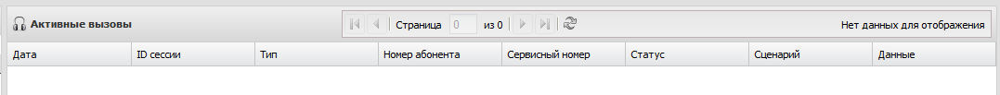

# Руководство пользователя

## Назначение системы
### Описание
Система предназначена для обработки голосовой информации и тональных сигналов (DTMF), обработки входящих и исходящих звонков, сбора информации от абонентов и занесение их в учётные системы, и позволяет:

- совершать звонки на телефоны клиентов (абонентов мобильной сети, а также абонентов фиксированной связи);
- записывать сигналы нажатия клавиш (DTMF);
- записывать голосовые сообщения;
- отправлять SMS, если возможно;
- проигрывать голосовые файлы;
- перенаправлять вызовы;
- использовать голосовое управление или тональный набор (DTMF).
	
Эти возможности реализуются сценариями, которые определяют поведение системы. Соединение осуществляется через SIP шлюз, который может располагаться как во внутренней, так и во внешней сети.

## Принцип работы
1. Есть два способа инициировать звонок:
   - Система инициирует звонок абоненту и после ответа запускает сценарий;
   - Абонент сам звонит на сервисный номер. При этом, в случае дозвона, запускается сценарий взаимодействия с клиентом.
2. Приняв звонок или позвонив самостоятельно на сервисный номер, абонент взаимодействует с системой, используя как тональный набор (DTMF) с клавиатуры телефонного аппарата, так и голосовой набор. Также абонент может надиктовать голосовое сообщение;
3. Система сохраняет ответы абонента в собственной базе данных;
4. По запросу пользователя системы формируется отчёт в Web интерфейсе;
5. Система поддерживает кодек G.711 µ-law и a-law.

## Возможные сценарии применения
- анкеты с простой последовательностью вопросов и сложной логикой разветвления вопросов (переход на ту или иную ветку осуществляется в зависимости от ответа абонента);
- система сбора данных в любых сферах деятельности, например, по приборам учёта ЖКХ (электросчётчик, газовый счётчик, счётчики воды и т. п.), а также любых других данных, собираемых в автоматическом режиме;
- интерактивное IVR меню;
- автоматизация call-центров;
- предоставление информации в автоматическом режиме, например, состояние счёта или курс валют;
- опросы клиентов (абонентов) для оценки, например, работы оператора справочной службы;
- банки и кредитные организации;
- торговля;
- оказание услуг;
- операторы связи;
- маркетинговые исследования и опросы;
- телемаркетинг и реклама.

## Описание интерфейса взаимодействия с системой
### Вход в систему
Работа с системой осуществляется при помощи веб-интерфейса. Для входа в систему необходимо в адресной строке браузера ввести имя или IP адрес сервера, на котором работает веб-интерфейс с указанием порта. Также требуется ввести логин и пароль.

Рисунок 1. Ввод адреса сервера в адресную строку браузера

Рисунок 2. Ввод пароля

Все эти параметры определяет администратор, настраивающий систему. Перед началом работы пользователи должны быть оповещены какой адрес и порт необходимо вводить, и под каким логином и с каким паролем они зарегистрированы в системе. Логин и пароль пользователь должен хранить в недоступном для других месте.

### Общий вид интерфейса

Рисунок 3: Общий вид интерфейса системы

Главная страница представляет собой окно, состоящее из двух частей. В левой части находится меню, в правой, содержимое отображаемое при выборе соответствующего пункта меню. Также рядом панелью с заголовком программы расположена панель, где показан статус подключения заданных в настройках шлюзов. По умолчанию выбирается пункт меню «Активные вызовы».

### Меню
В левой части окна расположена панель с названием системы и значком доступности сервера. Под названием показывается время на сервере, где установлен MARS. Ниже находится меню.

Рисунок 4. Меню системы

#### Задачи

Рисунок 5. Содержимое окна пункта меню «Задачи»

Задача — это некоторые действия, которые выполняются при наступлении указанного события.

При выборе пункта меню «Задачи» область окна правее области меню делится на 2 части, где можно создавать новые задачи и настраивать существующие.

В первой части расположена панель с названием пункта меню и кнопками операций с задачами , с помощью которых можно создать новую задачу, создать копию выбранной существующей задачи, переименовать выбранную задачу и удалить выбранную задачу.

Во второй части расположена панель с указанием имени настраиваемой задачи, ниже располагаются непосредственно сами параметры. Эта панель содержит 3 панели: «Параметры», «Запуск», «Сценарий». Панель «Параметры» содержит параметры задачи, панель «Запуск» содержит параметры запуска задачи, панель «Сценарий» содержит графическое представление выбранного сценария, который будет выполняться при запуске задачи.

##### Операции с задачами
Для совершения той или иной операции с задачами надо нажать соответствующую этой операции кнопку.

- создание новой задачи. После нажатия появится окно со строкой ввода для указания имени создаваемой задачи.

Рисунок 6. Запрос на ввод имени задачи

Надо ввести название задачи и нажать кнопку «ОК», после чего новая задача появится в списке задач. После этого можно настроить задачу для выполнения нужного действия. Или нажать кнопку «Отмена» для отмены создания задачи.

- создание копии выбранной задачи. После нажатия появится окно со строкой для ввода нового имени задачи. При этом строка ввода уже содержит старое имя задачи с дополнением имени текстом «_copy». Можно оставить имя без изменений или исправить предложенное. Для сохранения изменений нажать кнопку «ОК». Для отмены копирования нажать кнопку «Отмена».

Рисунок 7. Запрос на ввод имени копии задачи

- переименование выбранной задачи. После нажатия появится окно со строкой для ввода нового имени задачи. При этом строка ввода уже содержит старое имя задачи.

Рисунок 8. Запрос на ввод нового имени задачи

Можно оставить имя без изменений или исправить предложенное. Для сохранения изменений нажать кнопку «ОК». Для отмены переименования нажать кнопку «Отмена».

- удаление выбранной задачи. После нажатия появится окно с вопросом об удалении.

Рисунок 9. Запрос на удаление задачи

Для подтверждения нажать кнопку «Да», для отказа от удаления нажать кнопку «Нет». После подтверждения удаления задача сразу удаляется из списка задач и ВОССТАНОВИТЬ ЕЁ УЖЕ НЕЛЬЗЯ.

##### Настройки задачи

Рисунок 10. Параметры задачи

Панель «Параметры» содержит настройки по определению действия задачи. Для того, чтобы задача выполнилась надо поставить «галочку» в поле «Активный». Чтобы определить какие действия будет выполнять задача, надо в поле «Сценарий» выбрать сценарий из списка. Поле, отмеченное знаком * обязательно к заполнению.

Рисунок 11. Панель «Запуск» с разными вариантами запуска задачи

Панель «Запуск» позволяет запускать задачу двумя различными способами: по событию и по расписанию. 

Для запуска задачи по событию надо выбрать вкладку «По событию» и указать в выпадающем списке событие, наступление которого запустит задачу. Запуск по событию можно использовать для входящих в систему звонков. 

Для запуска задачи по расписанию надо выбрать вкладку «По расписанию». Для этого надо заполнить поля, находящиеся в этой вкладке: 

- «Время» - определяет время запуска задачи. Можно выбрать в выпадающем списке присутствующий там вариант значения времени, либо ввести другое значение.
- «Дата» - определяет дату запуска задачи. Здесь можно выбрать один из трёх вариантов: 1) число — ввод даты из выпадающего календаря (надо нажать на пиктограмму справа от поля ввода числа), либо ввести дату вручную. В этом случае формат даты должен быть таким: число.месяц.год. Год содержит две последние цифры числа года; 2) каждый день — задача будет запускаться каждый день в указанное время; 3) каждый день недели — в этом случае можно выбрать конкретные дни недели в которые будет запускаться задача в указанное выше время. Для выбора надо кликнуть мышкой на нужные дни недели (можно выбрать несколько).
- «Формат crontab*» – если заполнить поле «Дата», это поле заполняется автоматически. Либо можно не заполнять поле «Дата», а заполнить только это поле в формате crontab.
- «Абоненты*» - из выпадающего списка выбирается список абонентов. Либо, если нет нужного списка, можно здесь же загрузить файл со списком. Для этого надо нажать  и выбрать нужный файл, содержащий список абонентов (как создать список будет описано далее).
- «SIP подключение» - выбор подключения (шлюза) через которое будет осуществляться вызов.
Поля, отмеченные знаком * обязательны к заполнению.

Для сохранения выбранных параметров надо нажать кнопку «Сохранить», расположенную под панелью «Запуск». Если параметры указаны верно, будет сообщено, что данные сохранены.

Рисунок 12: Успешное сохранение данных

Если сообщения нет, значит параметры указаны неверно.

#### Активные вызовы
При загрузке системы этот пункт меню выбирается по умолчанию. Здесь показываются текущие вызовы, которые осуществляются с помощью системы MARS. Таких вызовов в некоторый момент времени может быть несколько, может быть только один или не быть совсем.

Рисунок 13. Активный вызов

Рисунок 14. Отображение завершения вызова

Рисунок 15. Нет активных вызовов

В этом пункте меню можно только посмотреть активные вызовы. Повлиять на их течение нельзя.

#### Коллекции
При двойном щелчке левой клавишей мыши на этом пункте появляются/скрываются подпункты этого меню. Это контейнер, содержащий подпункт «Абоненты».

##### Абоненты

Рисунок 16. Содержимое меню «Абоненты»

При выборе пункта меню «Абоненты» область окна правее области меню делится на 2 части, которые позволяют создавать новых абонентов и производить операции с существующими.

В первой части расположена панель с названием пункта меню и кнопками операций со списками абонентов , с помощью которых можно обновить список абонентов, создать новый список абонентов, создать копию выбранного существующего списка абонентов, переименовать выбранный список абонентов и удалить выбранный список абонентов. Все наименования элементов, лежащих под заголовком «Наименование» в этой части являются списками абонентов, состоящих из нуля и более номеров абонентов.

Во второй части расположена панель с указанием имени настраиваемого списка абонентов, ниже располагаются кнопки импорта/экспорта списка абонентов, кнопка обновления и ниже номера абонентов (под заголовком «Номер абонента»). 

###### Операции со списками абонентов
Все операции со списками абонентов идентичны операциям с задачами.

###### Импорт/экспорт списков абонентов
Для импорта списка абонентов надо нажать кнопку . При этом появится окно выбора имени файла, содержащего список номеров импортируемых абонентов. После выбора файла список абонентов появится на странице. Файл, содержащий список абонентов должен быть текстовым, где каждый номер абонента располагается в отдельной строке.

Для экспорта списка надо нажать кнопку . При этом появится окно с запросом имени файла, куда будет сохранён список. Надо выбрать папку, куда будет сохранён файл и нажать кнопку «Сохранить». Файл сохраняется в формате XLSX.

#### Отчёты

Рисунок 17. Содержимое меню «Отчёты»

При выборе пункта меню «Отчёты» правее панели меню появляется панель «Отчёты», где отображаются события по входящим и исходящим вызовам. Содержимое меню «Отчёты» состоит из 3-х частей: 

1) Заголовочная часть, где наряду с заголовком «Отчёты» располагается панель для управления отображением событиями.

Рисунок 18. Панель управления отображением событиями отчёта

Здесь можно переходить сразу на нужную страницу отчёта, если страниц больше одной, обновить страницу, экспортировать отчёт в XLSX, выбрать максимальное число записей на странице. Обновлять страницу можно в ручном режиме просто нажимая на кнопку обновить, а можно в автоматическом, установив время обновления страницы. Режим обновления работает до тех пор пока он не будет изменён вручную выбором нового режима обновления (ручное или автоматическое).

Рисунок 19. Варианты обновления страницы отчёта

Если выбрано автоматическое обновление, на кнопке «Обновить» появляется обратный отсчёт времени . Когда время истечёт, страница будет обновлена автоматически, и снова включится обратный отсчёт времени.

2) Выбор диапазона даты и времени.

Рисунок 20. Выбор диапазона даты и времени

Здесь можно выбрать диапазон даты и времени, в который будут входить отображаемые события в отчёте;

3) Таблица, содержащая события отчёта

Рисунок 21. События отчёта

Здесь, кроме просмотра событий, можно управлять отображением событий.
Для сортировки отображаемых событий по дате/времени нужно кликнуть мышкой на заголовок столбца «Дата». Если была сортировка по возрастанию даты/времени, то будет по убыванию. И наоборот, если была по убыванию, будет по возрастанию. Точно также можно сортировать и по другим столбцам. Также можно ограничить количество показываемых событий с помощью фильтра. Под каждым полем в заголовке, кроме поля «Дата», есть поле для ввода данных фильтра. После установки фильтра будут показаны те записи, которые удовлетворяют условию. Можно установить фильтр сразу для нескольких полей. Фильтр в таком случае будет применён последовательно к результату предыдущего фильтра. Чтобы отменить фильтр, нужно кликнуть мышкой по крестику справа от поля фильтра.

Если в сценарии было указано, что нужно записывать входящий звуковой поток, тогда в последней колонке появится проигрыватель, с помощью которого можно прослушать записанный файл.

#### Выход
При выборе пункта меню «Выход» система завершает работу и пользователь перенаправляется на страницу авторизации.