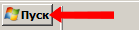
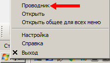

### Руководство по установке и запуску

#### Скачать MARS
Скачать MARS можно по адресу [http://kloud.one/download/setup.exe](http://kloud.one/download/setup.exe)

#### Установка MARS
Для того, чтобы установить MARS, скачиваем дистрибутив по ссылке [http://kloud.one/download/setup.exe](http://kloud.one/download/setup.exe), например в папку «C:\Downloads». Устанавливаем MARS.  Подводим курсор мыши к кнопке «Пуск»,

нажимаем правую клавишу мыши. Подводим курсор мыши к пункту «Проводник» и щелчком левой клавишей мыши выбираем его.

Открываем папку «C:\Downloads»:

- Подводим курсор мыши к папке «Компьютер» и делаем по ней двойной щелчок левой клавишей мыши (щёлкнуть один раз и сразу же щёлкнуть второй раз);
- Подводим курсор мыши к папке «С:» и делаем по ней двойной щелчок левой клавишей мыши;
- Подводим курсор мыши к папке «Downloads» и делаем по ней один щелчок левой клавишей мыши;
- Подводим курсор мыши к файлу «setup.exe» и делаем по нему двойной щелчок левой клавишей мыши.

Далее

Рекомендуем оставить стандартный путь. Иначе придётся каждый раз запускать приложение от имени администратора (т.к. оно задействует системные ресурсы).

Ждём пока загрузится

#### Запуск MARS
Для запуска нужно дважды кликнуть по ярлыку на рабочем столе.