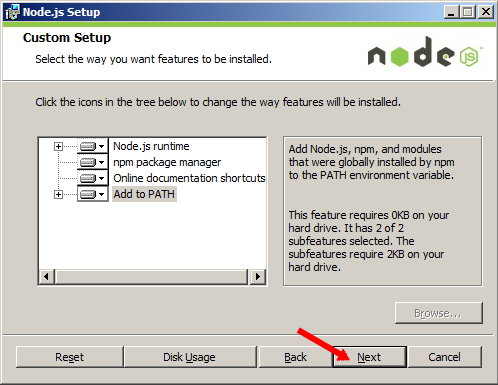
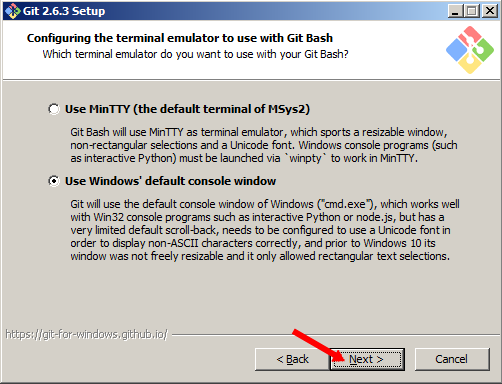
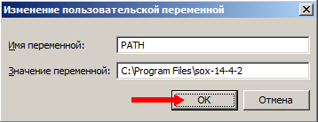

### Руководство по установке и запуску

#### Предварительные условия

Прежде чем установить и запустить MARS, нужно выполнить предварительные условия. Операционные системы, на которых была проверена работа MARS – это Windows 7 и Ubuntu 14.04 Server.

#### Node.js

Для запуска MARS нужно установить Node.js. Версия Node.js, под которой была проверена работа MARS – 4.2.1.

Для того, чтобы установить Node.js под Windows, скачиваем дистрибутив по ссылке [https://nodejs.org/download/release/v4.2.1/node-v4.2.1-x86.msi](https://nodejs.org/download/release/v4.2.1/node-v4.2.1-x86.msi), например в папку «C:\Downloads». Устанавливаем Node JS.  Подводим курсор мыши к кнопке «Пуск»,

нажимаем правую клавишу мыши. Подводим курсор мыши к пункту «Проводник» и щелчком левой клавишей мыши выбираем его.

Открываем папку «C:\Downloads»:

- Подводим курсор мыши к папке «Компьютер» и делаем по ней двойной щелчок левой клавишей мыши (щёлкнуть один раз и сразу же щёлкнуть второй раз);
- Подводим курсор мыши к папке «С:» и делаем по ней двойной щелчок левой клавишей мыши;
- Подводим курсор мыши к папке «Downloads» и делаем по ней один щелчок левой клавишей мыши;
- Подводим курсор мыши к файлу «node-v4.2.1-x86.msi» и делаем по нему двойной щелчок левой клавишей мыши.

Далее

Ждём, когда установится

Далее

Всё. Установка завершена.

Для установки под Ubuntu 14.04 Server выполним следующие команды:

- curl -sL https://deb.nodesource.com/setup\_4.x | sudo -E bash -
- sudo apt-get install -y nodejs

#### Установка git- клиента

Для обращения к репозиторию MARS нужно установить git-клиента. Для установки консольного клиента под Windows скачиваем дистрибутив по ссылке [https://github.com/git-for-windows/git/releases/download/v2.6.3.windows.1/Git-2.6.3-32-bit.exe](https://github.com/git-for-windows/git/releases/download/v2.6.3.windows.1/Git-2.6.3-32-bit.exe), например в папку «C:\Downloads».  Устанавливаем git-клиента. Подводим курсор мыши к кнопке «Пуск»,

нажимаем правую клавишу мыши. Подводим курсор мыши к пункту «Проводник» и щелчком левой клавишей мыши выбираем его.

Открываем папку «C:\Downloads»:

  1. Подводим курсор мыши к папке «Компьютер» и делаем по ней двойной щелчок левой клавишей мыши (щёлкнуть один раз и сразу же щёлкнуть второй раз);
  2. Подводим курсор мыши к папке «С:» и делаем по ней двойной щелчок левой клавишей мыши;
  3. Подводим курсор мыши к папке «Downloads» и делаем по ней один щелчок левой клавишей мыши;
  4. Подводим курсор мыши к файлу «Git-2.6.3-32-bit.exe» и делаем по нему двойной щелчок левой клавишей мыши.

Далее

Ждём, когда установится. 

Далее

Всё. Установка завершена.

Для установки под Ubuntu 14.04 Server выполним следующую команду:

    sudo apt-get install git

#### Установка SoX

Для работы со звуком в проекте MARS нужна утилита SoX. Для установкипод операционную систему Windows скачиваем дистрибутив по ссылке [http://downloads.sourceforge.net/project/sox/sox/14.4.2/sox-14.4.2-win32.exe?r=&amp;ts=1448462722&amp;use\_mirror=vorboss](http://downloads.sourceforge.net/project/sox/sox/14.4.2/sox-14.4.2-win32.exe?r=&amp;ts=1448462722&amp;use_mirror=vorboss), например, в папку «C:\Downloads». Устанавливаем SoX. Подводим курсор мыши к кнопке «Пуск»,

нажимаем правую клавишу мыши. Подводим курсор мыши к пункту «Проводник» и щелчком левой клавишей мыши выбираем его.

Открываем папку «C:\Downloads»:

  1. Подводим курсор мыши к папке «Компьютер» и делаем по ней двойной щелчок левой клавишей мыши (щёлкнуть один раз и сразу же щёлкнуть второй раз);
  2. Подводим курсор мыши к папке «С:» и делаем по ней двойной щелчок левой клавишей мыши;
  3. Подводим курсор мыши к папке «Downloads» и делаем по ней один щелчок левой клавишей мыши;
  4. Подводим курсор мыши к файлу «sox-14.4.2-win32.exe» и делаем по нему двойной щелчок левой клавишей мыши.

Далее

Ждём, когда установится. Далее

Всё. Установка завершена.

Для установки под Ubuntu 14.04 Server нужно выполним следующую команду:

    sudo apt-get install sox

Далее пропишем путь до файла sox.exe в переменную окружения path. В linux это делается автоматически. Сделаем это для Windows. Нажмём комбинацию клавиш &lt;Win+Pause&gt;

Путь задан. Теперь перзагружаем Windows для вступления в силу изменений.

#### MARS

Делаем локальную копию стабильной версии проекта:

    git clone https://github.com/komunikator/mars.git

После того, как локальная копия сделана, нужно установить зависимости проекта командой npm i из корневого каталога проекта (там, где находится файл package.json).

#### Запуск MARS

Для запуска нужно выполнить команду _node mars_ из корневого каталога проекта.